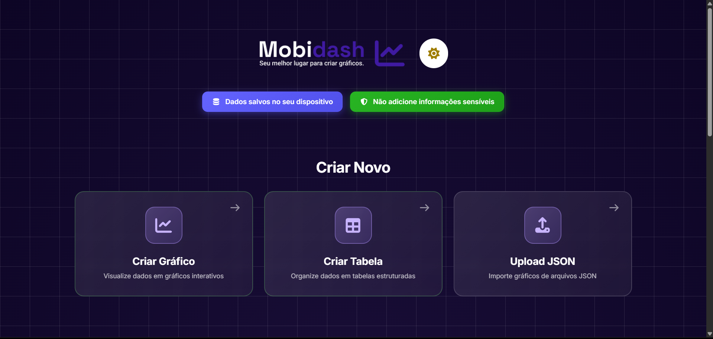
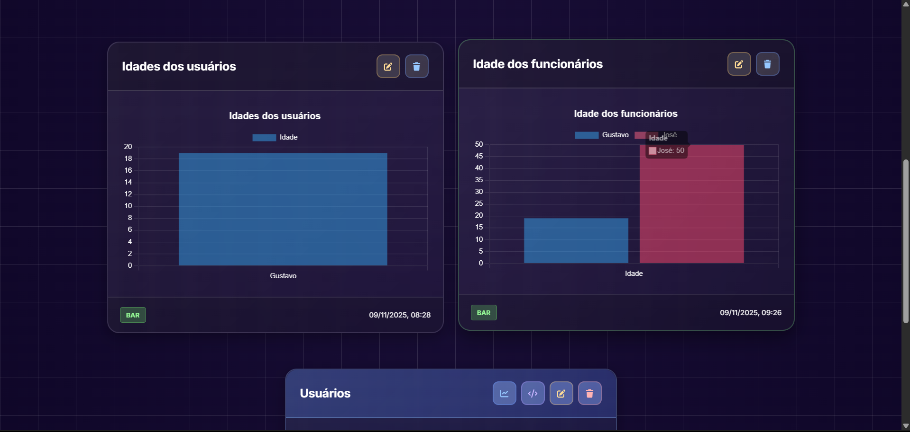

# 📈 Mobidash
  


Um dashboard simples e direto para visualizar dados através de gráficos e tabelas. Tudo salvo localmente no seu navegador, sem precisar de servidor ou banco de dados.





## O que é isso?

O Mobidash é uma aplicação web que te permite criar gráficos e tabelas de forma visual. Você pode:
- Criar gráficos interativos (barras, linhas, pizza, etc)
- Criar e gerenciar tabelas de dados
- Importar dados via arquivos JSON
- Converter tabelas em gráficos automaticamente
- Tudo fica salvo no seu navegador (localStorage)

## Por que fiz isso?

Queria aprender mais sobre manipulação de dados no frontend e criar algo útil sem precisar de backend.

## Tecnologias usadas

- HTML5, CSS3 e JavaScript (ES6+)
- Chart.js para os gráficos
- Font Awesome para os ícones
- LocalStorage para persistência de dados

## Como funciona?

1. Abra o `index.html` no navegador
2. Clique em "Criar Gráfico" ou "Criar Tabela"
3. Preencha os dados e salve
4. Seus dados ficam salvos localmente no navegador

## Estrutura do projeto

```
HTML_MOBIDASH_AI/
├── app/
│   ├── charts/          # Gerenciamento e renderização de gráficos
│   ├── tables/          # Gerenciamento de tabelas
│   ├── editors/         # Editores de gráficos e tabelas
│   ├── database/        # Persistência com localStorage
│   ├── validators/      # Validação de dados e arquivos
│   └── visual/          # Tema e grid visual
├── styles/
│   └── index.css        # Estilos principais
└── index.html           # Página principal
```

## Funcionalidades

- ✅ Criação de gráficos (bar, line, pie, doughnut, radar, polarArea)
- ✅ Criação de tabelas com schema customizável
- ✅ Importação de gráficos via JSON
- ✅ Conversão de tabelas para gráficos
- ✅ Exportação de tabelas para JSON
- ✅ Tema claro/escuro
- ✅ Interface responsiva
- ✅ Validação de dados e arquivos

## O que aprendi com esse projeto

Modularização de código JavaScript, como trabalhar com Chart.js, e principalmente sobre validação de dados no frontend.

## Notas sobre o desenvolvimento

Parte do código foi desenvolvido com auxílio de IA para acelerar o desenvolvimento e explorar diferentes padrões de código. Foi uma experiência interessante para aprender novas abordagens.

## Melhorias futuras

Quero adicionar mais tipos de gráficos, exportação para PDF, e talvez uma versão com backend para sincronização entre dispositivos

## Como contribuir

Se tiver alguma sugestão ou encontrar algum bug, fique à vontade para abrir uma issue ou fazer um pull request.

## Licença

Este projeto é open source e está disponível sob a licença MIT

---

Gustavo da Silva Santos - GS Soluções Pro.
